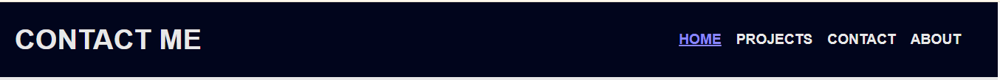
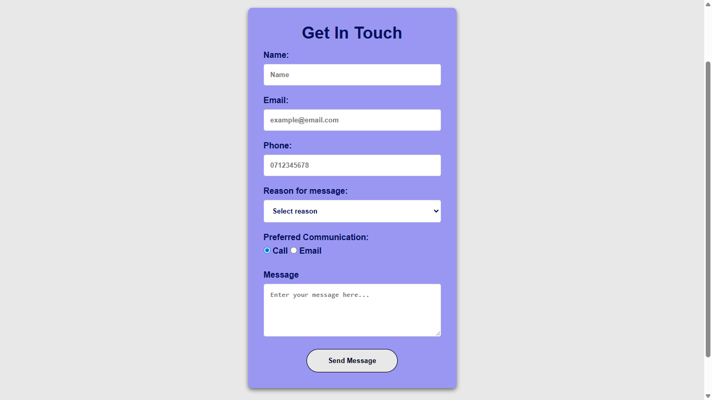
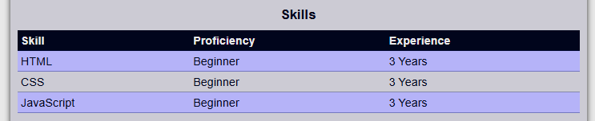
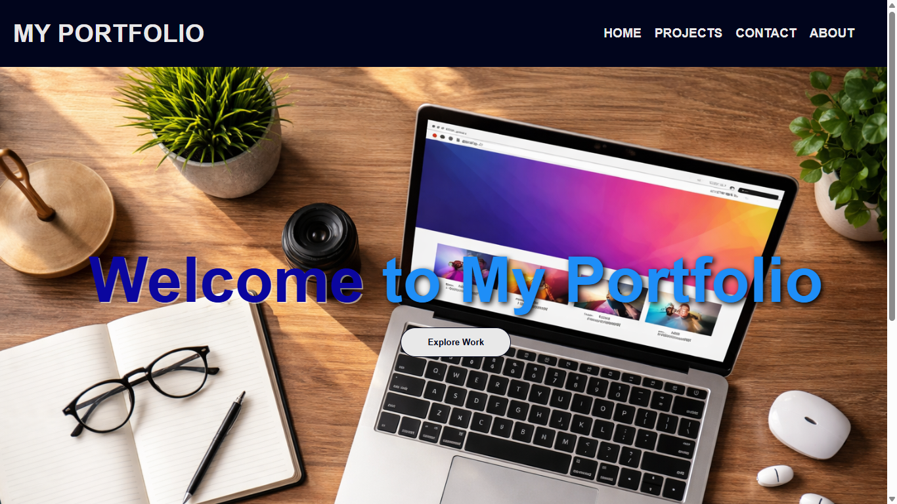
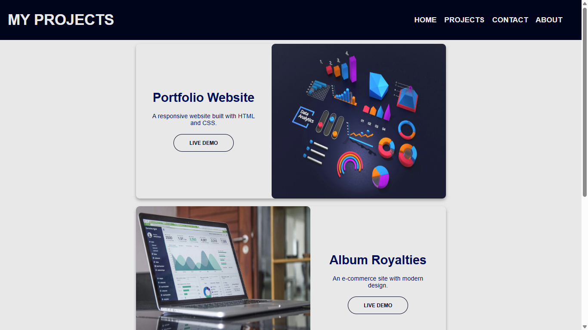
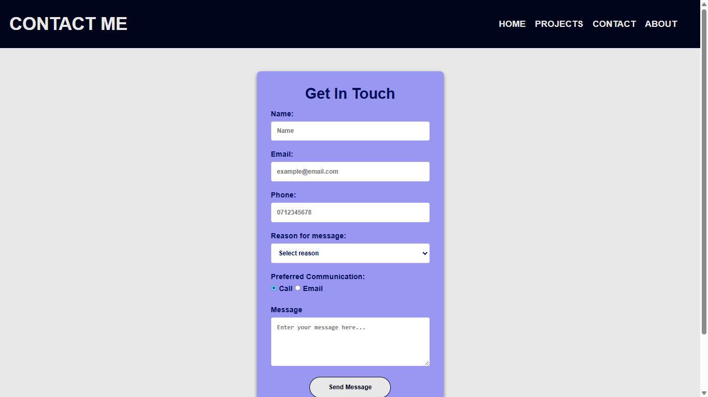
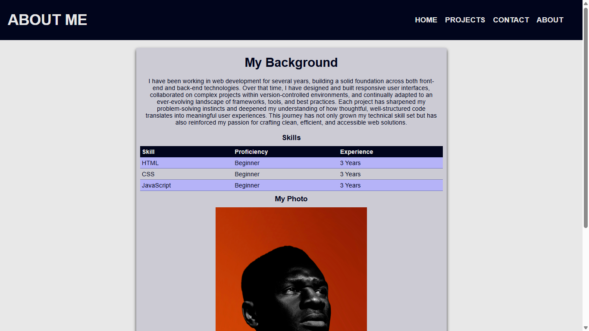

# Portfolio Website Overview

This is the codebase for a portfolio website project. The code is approximately 70% complete but contains errors, omissions, and areas that need improvement. I have to find and fix all of the errors, complete the codebase and then submit for review.

## How to set up project

### Clone the Repo
```bash
gh repo clone Umuzi-skillslab/complete-website-Abstract-Rothko
```
### Choose the correct directory
```bash
cd complete-website-Abstract-Rothko
```

#### No special requirements

## Issues Found

### HTML Files

- Essential meta tags were not included
- CSS file was not linked correctly
- Navigation bar with links were missing
- Form was incomplete
- Table needs to be included
- Elements were not semantically typed
- img elements needed alt attributes with alternative text
- classes like .header, .footer, and .intro need to change
- Third project is missing
- email needs a clickable link
- img src needs to be linked to actual photos

### CSS Files
- Font-family is incomplete.
- Navigation styling missing completely
- Poor colour contrast in .hero element
- Sizing issues with .hero img
- Only using 2-3 selector types, need 5+
- Form styling incomplete
- Missing: Box model demonstration (margin, padding, border)
- Missing: Block vs inline elements styling
- Missing: Text and colour styling variety
- Missing: Table styling
- Wrong alignment in footer element
- No comments

## Fixes Implemented

Steps taken to resolve project:

### 1. Identify all errors
- Went through all of the files and identified all the errors. You can view the file developed [here](../design/issues-identified.pdf)
- Create wireframes on what the Website could look like
- Run codebase through W3C Validator
- Acquire relevant photos

### 2. Code HTML Files
- Add semantic elements to files
- Add navigation to each file
- Include alternative text to images
- Add missing requirements(table, project, forms, etc...)
- Fix broken links

### 3. Code CSS
- Fix current styling
- Add styling to match wireframes
- Make sure code meets requirements

### 4. Review Code
- Test code to find any and all bugs
- Add accessibility features like colour contrast being more than 4.5:1 and hover effects on links and buttons
- Take screenshots of the website

### 5. Submission
- Submit final codebase

## Screenshots















## Lessons Learnt

This experience has taught me that it is important to practice more often. I need to get better at writing css code for multiple pages, making commits more regularly and deciding when it is best to use grid or flexbox layouts. The debugging process has been interesting to learn, but there is still a lot that I need to learn.

Thank you!
