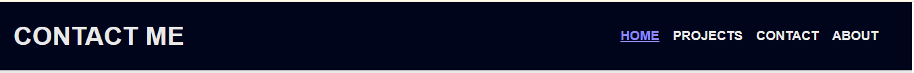
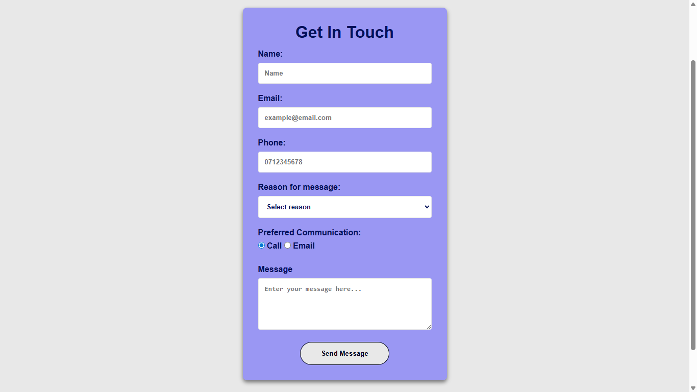
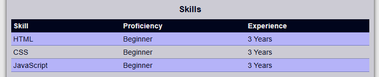
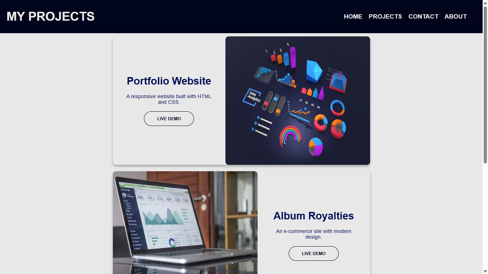
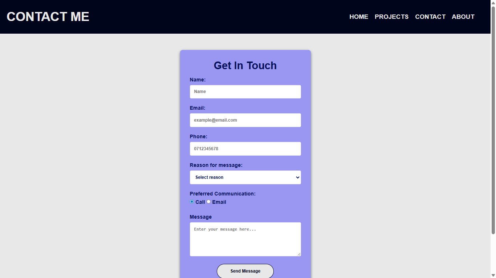
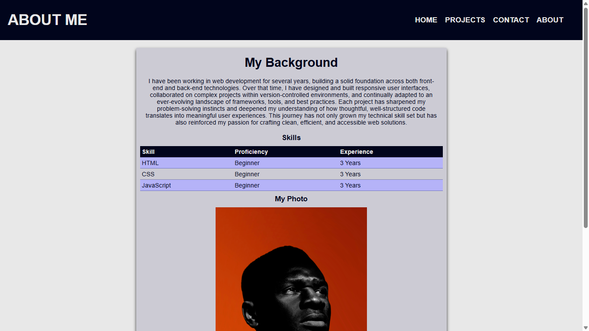

# Portfolio Website Overview

This is the codebase for a portfolio website project. The code is approximately 70% complete but contains errors, omissions, and areas that need improvement. I have to find and fix all of the errors, complete the codebase and then submit for review.

---
## How to set up project

### 1. Clone the Repo
```bash
gh repo clone Umuzi-skillslab/complete-website-Abstract-Rothko
```
### 2. Choose the correct directory
```bash
cd complete-website-Abstract-Rothko
```

### 3. Run `index.html` to view the Home Page

#### No special requirements

---

## Project Structure
 
```bash
portfolio-website/
│
├── css/
│   └── styles.css      
├── images/
│   ├── hero.png  
│   ├── portfolio.png
│   ├── project1.png
│   ├── project2.png
│   └── project3.png
│
├── design/
│   ├── wireframe.pdf        
│   └── issues-identified.pdf  
│
├── screenshots/
│   ├── about-screenshot.png    
│   ├── contacts-screenshot.png
│   ├── form-screenshot.png
│   ├── homepage-screenshot.png
│   ├── navbar-screenshot.png
│   ├── projects-screenshot.png
│   └── table-screenshot.png
│
├── about.html
├── contact.html
├── index.html
├── projects.html
└── README.md
```

---

## Issues Found

### HTML Files

- Missing `lang` attribute on `<html>`
- Missing `<meta>` tags: `charset`, `viewport`, `description`, and `author`
- Incorrectly linked stylesheet
- `<div>` used everywhere instead of semantic elements (`<header>`, `<main>`, `<footer>`, `<nav>`, `<section>`, `<article>`)
- No navigation and  missing `<ul>`, `<li>` structure and `<a>` links between pages
- Images missing proper `src` paths and `alt` attributes
- Footer email not wrapped in an `<a>` tag
- Unnecessary `class` attributes on header and footer element
- **index.html** - lorem ipsum placeholder text and unclear class name on a section
- **projects.html** - Third project entry is missing entirely (including its `<h2>`, ``, and `<p>`)
- **about.html** - Content sections are poorly nested; needs a `<table>` element with relevant data
- **contact.html** - Email input uses wrong type; `<form>` missing `action` and `method` attributes; no `<label>` elements; insufficient input types and validation

### CSS Files
- `font-family` is incomplete. It could be Arial, Helvetica, sans-serif.
- `.header` selector is missing proper alignment
- Navigation styling missing completely
- Poor colour contrast in `.hero` element
- Sizing issues with `.hero` img
- Only using 2-3 selector types, need 5+ selectors
- Pseudo-classes not used
- Combination selectors not used
- Form styling incomplete
- **Missing:** Box model demonstration (margin, padding, border)
- **Missing:** Block vs inline elements styling
- **Missing:** Text and colour styling variety
- **Missing:** Table styling
- Wrong alignment in footer element
- No comments
- `.intro` is an unclear, poor name
- No styling for project sections

---

## Fixes Implemented

Steps taken to resolve project:

### 1. Identify all errors
- Went through all of the files and identified all the errors. You can view the file developed [here](../design/issues-identified.pdf)
- Create wireframes on what the Website could look like
- Run codebase through W3C Validator
- Acquire relevant photos

### 2. Code HTML Files
- Add semantic elements to files
- Add navigation to each file
- Include alternative text to images
- Add missing requirements(table, project, forms, etc...)
- Fix broken links

### 3. Code CSS
- Fix current styling
- Add styling to match wireframes
- Make sure code meets requirements

### 4. Review Code
- Test code to find any and all bugs
- Add accessibility features like colour contrast being more than **4.5:1** and hover effects on links and buttons
- Take screenshots of the website

### 5. Submission
- Submit final codebase

## Screenshots

### Navigation Bar


### Form Section


### Table


### Homepage


### Projects Page


### Contacts Page


### About Page


---

## Lessons Learnt

This experience has taught me that it is important to practice more often. I need to get better at writing css code for multiple pages, making commits more regularly and deciding when it is best to use grid or flexbox layouts. The debugging process has been interesting to learn, but there is still a lot that I need to learn.

Thank you!
